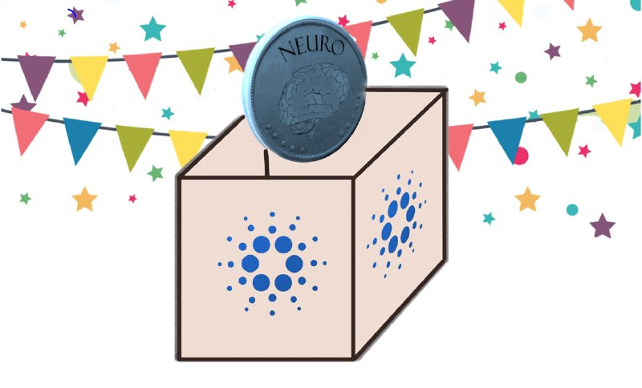

## Getting started

Like many others my immersion into the world of blockchain has been a gradual, evolving process. I’ve been fascinated by blockchain since around 2014 when I first heard of Bitcoin. It spoke to my frustrations with the financial status quo and I recognized the potential for blockchains to help us reclaim individual financial sovereignty. Despite my excitement, I was still hesitant and in hindsight perhaps a little over cautious! But over the years spent listening to people far smarter than myself, and starting to get hands on with the technology, my excitement turned into a deeply rooted conviction. I’m now fully committed to learning everything I can about the blockchain and exploring how it can be used to make the world, a better, fairer and more decentralised place.

## Enter Cardano

In late 2017 I became very interested in a project called Cardano. In what the time was a sea of ICO mania and unsubstantiated promises Cardano caught my attention with it's basis in peer reviewed research and it's clarity of mission to bank the unbanked, bringing identity & financial services to all regardless of their location or background.

## Proof of stake and stake pools

Traditional cryptocurrencies like Bitcoin use something called proof of work to validate transactions and secure the network. In short proof of work involes "miners" spenidng computational power in a race to mine the next block and adding a group of transactions to the blockchain. In this model the miners are rewarded for every block they validate.

An alternative to proof of work is called proof of stake. Instead of relying on computational power to validate blocks, proof of stake takes in to consideration the amount of coins held by a given party, along with some amount of randomness, to decide who will mint the next block of transactions. By delegating to a staking pool you are allowing that pool to act on your behalf (to the tune of the amount you are delegating) in being chosen to mint the next block. When the pool you're delegating to mints a block they share the rewards generated from that block with you and the other delegators of the pool. In the context of Cardano delegators to a healthy pool consistently producing blocks can expect to earn around 5 - 6% of their holdings in staking rewards (interest) a year.

The pool also keeps some rewards for itself (in our case 3% of the total rewards generated) and it's these rewards that we are committing 80% of to supporting neruodegenerative diesese research.

Proof of stake is a considerably less energy intensive mechanism than proof of work and thus is far more evironmentally friendly.

If that wasn't good enough, when staking your ADA it never leaves your wallet. You are free to move or sell your funds at any time and ownership of your ADA always remains with you. You are simply lending the pool your staking power and giving them the right to act on your behalf when it comes to minting a block.

## Taking the plunge

Over the 2020/2021 holiday period I started working on creating a stake pool and in early January I launched my pool, initially called DANA, based on the Buddhist principle of Dāna - charitable giving, or kindness in action. The idea was to explore ways in which staking could be used to do some good in the world and my intention was to donate a portion of pool earnings to good causes.

## A worthy cause

As I was gearing up to start marketing the pool, I came across a [post on reddit](https://www.reddit.com/r/cardano/comments/lqlcoy/how_cardano_could_help_cure_degenerative_brain/). I was so blown away by the sincerity, passion and purpose with which he appeared to be communicating that I reached out and we set up a call. By the end of that same week we were committed to working together, I had repurposed my pool, had **committed to giving 80% of the pools margins to funding nerodegenrative disease research**, and NEURO was live. In the short time I’ve known Ben, he has continued to surprise me every day and it’s safe to say that his passion, purpose and clarity of vision are infectious. In hindsight, I don’t think that DANA would have worked in the way I’d hoped without someone like Ben on board.

## Progress to date

So far, as of the time of writing, we have been able to raise an impresive 1.64m ADA in delegation and have already minted 3 blocks on the network. This means we're now officially earning rewards for our delegates, doing our small part to secure the network, and allocating 80% of our margins to fund neurodegenerative disease research.\
\
I'm excited to see where this journey will lead!
